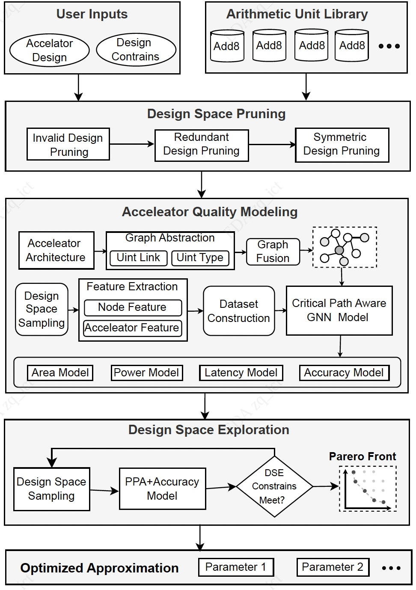

# ApproxPilot: A GNN-based Accelerator Approximation Framework


ApproxPilot is a research-oriented framework for approximate accelerator optimization. It integrates approximate design space construction, PPA/quality prediction, and multi-objective design space exploration into a unified workflow. The framework models approximate accelerators as graph-structured data, adopts graph neural networks as surrogate predictors, and incorporates critical-path information to improve latency modeling. The resulting predictions are further used to support Pareto-optimal approximate design search. The framework is evaluated on three representative benchmark applications: Sobel, Gaussian, and Kmeans.

---

## Paper and Citation

This repository corresponds to the following paper:

- **ApproxPilot: A GNN-based Accelerator Approximation Framework**
- arXiv: <https://arxiv.org/abs/2407.11324>
- IEEE ISEDA 2025

If you use the methods, code, or experimental organization in this repository, please cite the paper.

```bibtex
@inproceedings{zhang2025approximpilot,
  title={ApproxPilot: A GNN-based Accelerator Approximation Framework},
  author={Zhang, Qing and Liu, Siting and Hui, Yajuan and Liu, Cheng},
  booktitle={2025 International Symposium of Electronic Design Automation (ISEDA)},
  pages={226--231},
  year={2025},
  organization={IEEE}
}
````

---

## Overall Framework

<p align="center">
  
</p>

The overall workflow of ApproxPilot consists of three major stages:

1. **Design Space Pruning**
   The approximate arithmetic library and its combinations are pruned to reduce the candidate design space.

2. **PPA and Quality Modeling**
   Approximate accelerators are abstracted as graph structures, labeled datasets are constructed, and prediction models are built for Area, Power, Latency, and SSIM.

3. **Design Space Exploration**
   Candidate designs are rapidly evaluated using the learned predictors, and Pareto fronts are constructed for multi-objective optimization.

---

## Main Modules

### `GNN-model/`

The `GNN-model/` directory contains the graph neural network models used for hardware-aware prediction. It supports the following prediction targets:

* Area
* Power
* Latency
* SSIM

For latency prediction, a critical-path-aware mechanism is introduced to improve modeling accuracy.

### `approx_lib/`

The `approx_lib/` directory documents the approximate arithmetic units used in ApproxPilot. The approximate arithmetic units in this work are derived from [EvoApproxLib](https://github.com/ehw-fit/evoapproxlib). These units are used to construct and evaluate the approximate design space.

### `benchmarks/`

The `benchmarks/` directory documents the benchmark applications used in ApproxPilot. The benchmark applications in this work are derived from [AxBench](http://axbench.org/). The evaluation is conducted on three representative benchmarks:

* Sobel
* Gaussian
* Kmeans

### `dataset/`

The `dataset/` directory contains the dataset construction flow of ApproxPilot. It mainly includes:

* `ppa/`: scripts for extracting hardware metrics such as area, power, and latency from the synthesis flow
* `ssim/`: Python-based code for evaluating the output image quality metric SSIM

This module provides the labeled data required for model training and downstream design space exploration.

### `dse/`

The `dse/` directory contains the design space exploration flow and Pareto construction process. It performs efficient search over candidate designs based on the learned predictors. Different sampling strategies are compared, and NSGAIII is adopted as the main exploration method.

### `requirements/`

The `requirements/` directory documents the hardware and software environment used in ApproxPilot experiments, including hardware configuration, software versions, and major dependencies.

---

## Method Characteristics

* **End-to-end approximation optimization flow**
  ApproxPilot unifies design space pruning, performance/quality modeling, and design space exploration within a single framework.

* **Critical-path-aware latency modeling**
  Critical-path information is incorporated into graph-based prediction to improve latency estimation accuracy.

* **Multi-objective optimization**
  The framework jointly considers area, power, latency, and output quality for approximate design search.

---

## Highlights of Results

Experiments are conducted on three benchmark applications, Sobel, Gaussian, and Kmeans. The results show that:

* ApproxPilot outperforms AutoAX on multiple benchmarks, with more pronounced advantages on Gaussian and Kmeans.
* The critical-path-aware GNN outperforms random forest and baseline GNN in latency prediction.
* On the Gaussian latency prediction task, the critical-path-aware GNN improves R² by 25% over random forest and by 20% over the baseline GNN.

---

## Usage

This repository is organized according to the overall ApproxPilot workflow, and the basic usage is as follows:

1. **Dataset Construction**
   Construct approximate design samples in the `dataset/` directory and obtain the corresponding PPA and SSIM labels.

2. **Model Training and Prediction**
   Train and evaluate prediction models for Area, Power, Latency, and SSIM in the `GNN-model/` directory.

3. **Design Space Exploration**
   Perform multi-objective design space exploration and construct Pareto fronts in the `dse/` directory based on the prediction results.

Additional information about benchmark sources, approximate arithmetic units, and experimental environments can be found in `benchmarks/`, `approx_lib/`, and `requirements/`.

---


## Notes

This repository is organized as a research-oriented implementation of the ApproxPilot framework. It includes the main components for dataset construction, graph-based prediction, and design space exploration, together with benchmark and approximate library descriptions used in the experiments.


